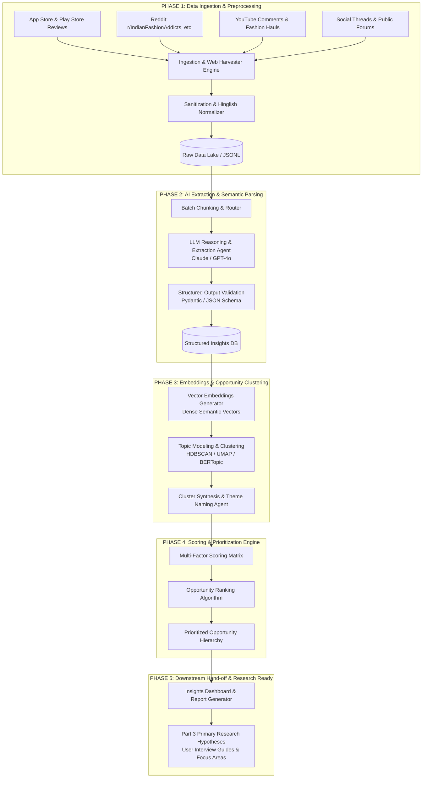
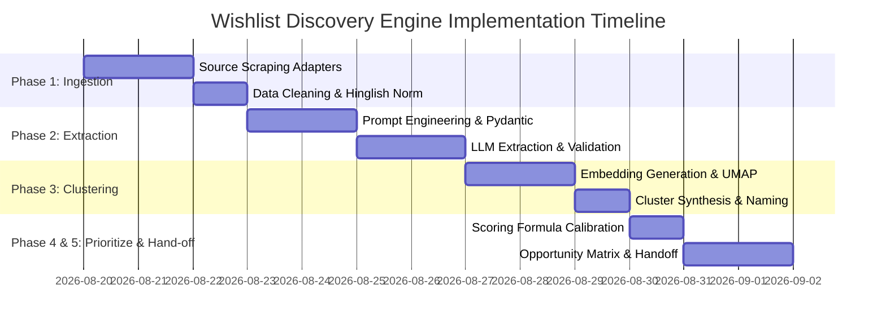

# Phase-Wise System Architecture: AI-Powered Wishlist Discovery Engine

This document defines the complete technical and operational architecture for the **AI-Powered Discovery Engine** designed to analyze public at-scale customer conversations and identify why Myntra wishlisted fashion items stall before purchase.

---

## 1. High-Level Architecture Overview



---

## 2. Detailed Phase-by-Phase Architecture

---

### Phase 1: Multi-Channel Public Data Harvesting & Preprocessing

```
┌──────────────────────────────────────────────────────────────────────────┐
│                    PHASE 1: DATA INGESTION & PIPELINE                    │
└──────────────────────────────────────────────────────────────────────────┘
```

#### 1.1 Ingestion Sources & Adapters
- **App Store & Google Play Reviews:** Fetch customer feedback using store scrapers targeting keywords: *wishlist*, *cart*, *price*, *size*, *return*, *quality*, *expensive*, *later*.
- **Reddit Ingestion:** Utilize Reddit API (`PRAW`) to scrape submissions and comments from subreddits including:
  - `r/IndianFashionAddicts`
  - `r/TwoXIndia`
  - `r/dealsforindia`
  - `r/IndianSkincareAddicts` (cross-fashion threads)
- **YouTube Fashion Hauls & Try-on Reviews:** Target comments from Myntra try-on hauls, sale recommendation videos, and sizing guide creators via YouTube Data API v3.
- **X (Twitter) & Public Forums:** Ingest public complaints, customer queries, and discussion threads about Myntra shopping habits.

#### 1.2 Preprocessing & Data Sanitization
1. **Deduplication:** Hashing content to remove syndicated cross-posts and bot spam.
2. **Noise Reduction:** Stripping out emojis, promo codes, referral links, and non-informative one-word reviews (e.g., "Good", "Nice app").
3. **Hinglish & Slang Normalization:** Handling transliterated Hindi-English phrases common in Indian fashion e-commerce (e.g., *"kapda patla hai"*, *"fit sahi nahi aaya"*, *"sale ka wait kar raha tha"*).
4. **Context Windowing:** Preserving the parent thread context (e.g., post title + user reply) so the LLM understands conversational nuance.

---

### Phase 2: AI Extraction & Semantic Parsing

```
┌──────────────────────────────────────────────────────────────────────────┐
│                PHASE 2: INTENT & FRICTION EXTRACTION                     │
└──────────────────────────────────────────────────────────────────────────┘
```

#### 2.1 Friction Taxonomy Definition
The extraction agent classifies each user utterance against a domain-specific taxonomy:

| Primary Category | Sub-Friction Codes | Description / Example |
| :--- | :--- | :--- |
| **Product Uncertainty** | `UNCERT_SIZE_FIT`<br>`UNCERT_FABRIC_QUALITY`<br>`UNCERT_COLOR_MISMATCH`<br>`UNCERT_STYLING` | Doubts on whether size runs small/large, sheer fabric, real color vs. studio lighting, styling versatility. |
| **Financial / Timing Dynamics** | `PRICE_AWAIT_DISCOUNT`<br>`PRICE_COMPETITOR_LOWER`<br>`PRICE_BUDGET_EXCEEDED` | Waiting for EORS / Big Fashion Festival, comparing with Ajio/Zara, price perceived too high for item value. |
| **Psychological / Social Validation** | `VAL_PEER_CONFIRMATION`<br>`VAL_OCCASION_EVENT`<br>`VAL_IMPULSE_COOLDOWN` | Asking friends/partners for opinions, waiting for an upcoming event, cooling down after initial excitement. |
| **Wishlist Behavioral Mode** | `BEH_AESTHETIC_BOOKMARK`<br>`BEH_OOS_MONITORING`<br>`BEH_CART_OVERFLOW` | Using wishlist as a vision board/catalog bookmark, tracking out-of-stock sizes, moving items from cart to save space. |
| **Post-Order / Logistics Anxiety** | `LOG_DELIVERY_CHARGES`<br>`LOG_RETURN_FRICTION`<br>`LOG_DELIVERY_DELAY` | Extra platform/convenience fee added at checkout, hassle of returns/exchanges. |

#### 2.2 LLM Reasoning & Extraction Schema
Using strict JSON Schema validation (Pydantic models) to ensure reproducible and structured data:

```json
{
  "source": "Reddit | AppStore | YouTube",
  "raw_text": "Saved this kurti on wishlist for 2 weeks but reviews say fabric is transparent and size S runs like XS...",
  "detected_friction_category": "Product Uncertainty",
  "friction_sub_codes": ["UNCERT_FABRIC_QUALITY", "UNCERT_SIZE_FIT"],
  "purchase_intent_signal": "HIGH",
  "root_cause_summary": "Customer stalled purchase due to conflicting reviews regarding sheer fabric and non-standard sizing.",
  "sentiment_intensity_score": -0.75,
  "product_category": "Ethnic Wear / Kurtis",
  "price_sensitivity_mentioned": false,
  "confidence_score": 0.92
}
```

---

### Phase 3: Embeddings & Opportunity Clustering

```
┌──────────────────────────────────────────────────────────────────────────┐
│                PHASE 3: VECTOR CLUSTERING & SYNTHESIS                    │
└──────────────────────────────────────────────────────────────────────────┘
```

#### 3.1 Semantic Vector Representation
- Extracted root-cause summaries and context snippets are converted into dense vector embeddings using `text-embedding-3-large` or `all-mpnet-base-v2`.
- Embeddings capture subtle semantic nuances across varied vocabularies and phrasings.

#### 3.2 Unsupervised Topic Clustering
- **Dimensionality Reduction:** UMAP (Uniform Manifold Approximation and Projection) reduces embedding dimensions while preserving local and global structures.
- **Density-Based Clustering (HDBSCAN):** Groups dense areas of similar user friction points into distinct clusters without forcing pre-fixed cluster counts.
- **Cluster Synthesis Agent:** An LLM reviews sample exemplars from each cluster and automatically generates:
  1. A clear **Opportunity Area Title** (e.g., *"Size Confidence Deficit in Women's Western Wear"*).
  2. A **Comprehensive Narrative Summary** of the friction pattern.
  3. **Key Contributing Triggers** and representative user quotes.

---

### Phase 4: Quantitative Scoring & Prioritization Engine

```
┌──────────────────────────────────────────────────────────────────────────┐
│            PHASE 4: QUANTITATIVE PRIORITIZATION ALGORITHM                │
└──────────────────────────────────────────────────────────────────────────┘
```

#### 4.1 Multi-Dimensional Scoring Framework
To rank opportunity areas objectively, each cluster is evaluated across 4 dimensions:

$$\text{Opportunity Score} = \left( w_1 \cdot V_{\text{norm}} + w_2 \cdot S_{\text{norm}} + w_3 \cdot I_{\text{norm}} \right) \times C$$

Where:
1. **Prevalence & Volume Score ($V$):** Total number of distinct mentions across ingested data streams ($w_1 = 0.35$).
2. **Emotional Friction Severity ($S$):** Intensity of frustration, hesitation, and regret detected in user expressions ($w_2 = 0.25$).
3. **Conversion Impact Potential ($I$):** Estimated likelihood that resolving this friction directly unlocks checkout conversion ($w_3 = 0.40$).
4. **Cross-Channel Confidence Multiplier ($C$):** Score between $0.8$ and $1.0$, penalized if evidence comes from only a single source, boosted if corroborated across Reddit, App Store, and YouTube.

#### 4.2 Ranked Opportunity Output Matrix
```
Rank 1: Size & Fit Uncertainty (Score: 88.4 / 100)
        ↳ Driven by non-standard brand size charts and fear of return logistics.
Rank 2: Price-Drop Speculation & Sale Waiting (Score: 82.1 / 100)
        ↳ Users hold items until predictable festival sales or sudden price drop alerts.
Rank 3: Visual & Fabric Reality Gap (Score: 76.5 / 100)
        ↳ Lack of real-customer try-on videos / unfiltered photos on product detail pages.
Rank 4: Wishlist as Aspirational Moodboard (Score: 68.2 / 100)
        ↳ Users saving items without immediate purchasing intent (catalog hoarding).
```

---

### Phase 5: Downstream Transition & Research Hand-off

```
┌──────────────────────────────────────────────────────────────────────────┐
│               PHASE 5: PRIMARY RESEARCH & PART 3 HAND-OFF                │
└──────────────────────────────────────────────────────────────────────────┘
```

#### 5.1 Artifacts Delivered to Primary Research Teams
1. **Opportunity Area Briefs:** Deep-dive executive sheets for the top 3 ranked opportunity areas.
2. **Target User Persona Profiles:** Archetypes identified during extraction (e.g., *The Deal Hunter*, *The Hesitant Trend-Seeker*, *The Return-Averse Shopper*).
3. **Hypothesis Formulation & Interview Scripts:**
   - Pre-drafted open-ended questions tailored to investigate specific root causes identified in public data.
   - Example: *"When you saved item [X], what specific detail on the page made you decide not to proceed to checkout right then?"*

---

## 3. Technology Stack & Tooling Selection

| Component | Recommended Tool / Framework | Alternative / Open Source |
| :--- | :--- | :--- |
| **Pipeline Orchestrator** | Python / Prefect / n8n | Zapier / Temporal |
| **Data Ingestion** | `google-play-scraper`, `praw` (Reddit), YouTube API v3 | Apify / Playwright scrapers |
| **LLM Reasoning & Extraction** | Claude 3.5 Sonnet / OpenAI GPT-4o | DeepSeek-V3 / Llama-3-70B |
| **Validation Layer** | Pydantic v2 (Strict Schema Enforcement) | Instructor / Outlines |
| **Embeddings & Vector Store** | OpenAI `text-embedding-3-large` + ChromaDB | Qdrant / FAISS |
| **Clustering & Synthesis** | UMAP + HDBSCAN + BERTopic | Scikit-learn Agglomerative |
| **Storage & Output** | PostgreSQL / SQLite + JSONL exports | Parquet / DuckDB |
| **Visualization & Reporting** | Streamlit / Markdown Summary Dashboards | Metabase / Observable |

---

## 4. Execution Roadmap & Milestones


