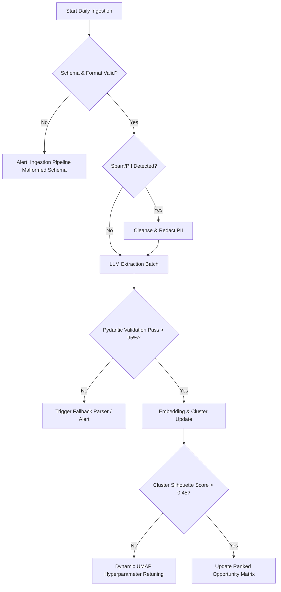

# Detailed Edge Cases & Mitigation Strategies: AI-Powered Wishlist Discovery Engine

This document provides a comprehensive breakdown of technical, algorithmic, linguistic, and behavioral **edge cases** across all five phases of the Myntra Wishlist Discovery Engine, along with concrete **detection mechanisms** and **mitigation strategies**.

---

## 1. Summary Edge Case Matrix

| Phase | Edge Case Category | Primary Risk | Mitigation Approach |
| :--- | :--- | :--- | :--- |
| **Phase 1** | Ingestion & Linguistics | Hinglish code-switching, sarcasm, emoji-only feedback | Multi-lingual LLM preprocessing + slang normalization dictionaries |
| **Phase 1** | Data Quality | Affiliate bot spam, delivery-only rants, app crash logs | Pre-LLM heuristic filters & regex blacklist |
| **Phase 2** | Semantic Extraction | Compound multi-intent feedback, Wishlist vs. Cart confusion | Multi-label extraction schemas & intent disambiguation prompt layers |
| **Phase 2** | Contextual Drift | Outdated sale events & temporal decay | Timestamp windowing & dynamic recency weighting |
| **Phase 3** | Embeddings & Clustering | Generic noise mega-clusters (e.g., "Too costly") | Sub-clustering hierarchies + Stopword/Polysemy embeddings tuning |
| **Phase 3** | Cluster Fragmentation | Niche categories (Plus-size, Maternity, Ethnic sarees) isolated | Soft-clustering / Overlapping membership (HDBSCAN prob-scores) |
| **Phase 4** | Prioritization & Scoring | Vocal minority bias (extreme rants overpowering silent intent) | Multi-source corroboration multiplier + Demographics normalization |
| **Phase 5** | Downstream Research | Non-actionable or subjective hypotheses | PII scrubbing + Evidence traceability with verbatim audit trails |

---

## 2. Phase 1: Data Ingestion & Preprocessing Edge Cases

### 1.1 Hinglish, Vernacular Code-Switching & Fashion Slang
* **The Edge Case:** Indian shoppers heavily blend Hindi and English in comments (e.g., *"Kurti ka kapda ekdum transparent nikla, wishlist se delete maar diya"*, *"Bhai sale aane ka wait karu ya le lu?"*, *"Fitting ajeeb hai, shoulder gir raha hai"*).
* **Failure Mode:** Standard tokenizers or generic English sentiment models miss the core friction (sheer fabric, sale anticipation, shoulder fit) or misclassify it as neutral/garbage text.
* **Mitigation:**
  - Implement a specialized **Hinglish Tokenizer & Idiom Mapper** prior to extraction.
  - Use multilingual foundation models (Claude 3.5 Sonnet / GPT-4o) with explicit prompt instructions recognizing Indian fashion vernacular (e.g., *ghera*, *pallu*, *kapda*, *nakli*, *fitting*).

### 1.2 Multi-Intent & Compound User Utterances
* **The Edge Case:** A single user comment contains multiple opposing intents and frictions:
  > *"I loved the embroidery and saved it for Diwali, but then 5 people reviewed that color fades after 1 wash, and now the price shot up by ₹600 so it's just sitting in my wishlist."*
* **Failure Mode:** Single-label classifiers force an arbitrary pick (e.g., tagging only `PRICE_BUDGET_EXCEEDED` and dropping `UNCERT_FABRIC_QUALITY` and `VAL_OCCASION_EVENT`).
* **Mitigation:**
  - Use **Multi-Label Extraction** where the LLM returns an array of discrete friction objects:
    ```json
    "friction_points": [
      {"category": "Product Uncertainty", "code": "UNCERT_FABRIC_QUALITY", "detail": "Color fading after wash"},
      {"category": "Financial Dynamics", "code": "PRICE_AWAIT_DISCOUNT", "detail": "Price increased by ₹600"},
      {"category": "Psychological Validation", "code": "VAL_OCCASION_EVENT", "detail": "Saved for Diwali"}
    ]
    ```

### 1.3 Off-Topic Noise, Platform Complaints & Affiliate Spam
* **The Edge Case:** App Store reviews filled with delivery partner behavior, refund bank delays, app crash logs, or Instagram bot spam (*"Earn ₹500/day DM me"*).
* **Failure Mode:** Pollutes topic clustering with non-product/non-wishlist operational grievances.
* **Mitigation:**
  - **Rule-based Pre-Filter:** Drop comments matching spam regex, coupon code solicitations, and app crash logs.
  - **Relevance Gatekeeper Prompt:** A fast, lightweight classification step (e.g., GPT-4o-mini / Haiku) verifying whether the comment relates to *product consideration, purchasing hesitation, pricing, or catalog experience*.

---

## 3. Phase 2: AI Extraction & Semantic Parsing Edge Cases

### 2.1 Terminology Interchangeability ("Wishlist" vs "Cart" vs "Saved for Later")
* **The Edge Case:** Users often write *"It's in my bag for 2 weeks"* or *"I saved it in cart"* when referring to wishlist behavior, or vice-versa.
* **Failure Mode:** Strict keyword search for `"wishlist"` misses up to 40% of pre-purchase hesitation signals.
* **Mitigation:**
  - Broaden harvest query patterns to include behavioral synonyms: *"saved for later"*, *"in my cart for weeks"*, *"thinking to buy"*, *"waiting to buy"*, *"added to bag but didn't checkout"*.
  - Instruct the AI extraction layer to identify the **behavioral state** (pre-purchase stalling) regardless of whether the user called it cart, bag, or wishlist.

### 2.2 Sarcasm, Irony & Nuanced Sentiment
* **The Edge Case:** Sarcastic comments such as:
  > *"Great job Myntra, your size chart thinks an Indian XL is a UK toddler size! Kept in wishlist hoping you learn math."*
* **Failure Mode:** Basic sentiment models parse "Great job" as positive.
* **Mitigation:**
  - Leverage chain-of-thought (CoT) reasoning in the LLM extraction prompt: instruct the model to first explain the user's emotional state before assigning sentiment and root-cause codes.

### 2.3 Product Category Divergence (Contextual Meaning Shift)
* **The Edge Case:** The friction term *"fitting issue"* has completely different operational roots across categories:
  - **Western Jeans/Trousers:** Waist-to-hip ratio, thigh tightness, length/inseam.
  - **Ethnic Kurtis:** Armhole tightness, bust darts, shoulder slope.
  - **Footwear:** Arch support, narrow toe box, shoe bite.
* **Failure Mode:** Generic grouping into a vague *"Fit Issue"* without category context.
* **Mitigation:**
  - Mandatory extraction field for `inferred_product_category` (e.g., *Ethnic Wear, Western Bottoms, Footwear, Lingerie*).
  - Cluster separately per category when evaluating product-specific uncertainty.

---

## 4. Phase 3: Embeddings & Opportunity Clustering Edge Cases

```
┌──────────────────────────────────────────────────────────────────────────┐
│              EMBEDDING & CLUSTERING EDGE CASE RESOLUTION                 │
└──────────────────────────────────────────────────────────────────────────┘
```

### 4.1 The "Mega-Cluster" Phenomenon (Generic Price Sensitivity)
* **The Edge Case:** A massive proportion of reviews simply state *"Too expensive"* or *"Waiting for sale"*, creating a gravitational mega-cluster that swallows nuanced sub-behaviors.
* **Failure Mode:** The model reports a trivial top opportunity: *"Users want cheaper prices"*, masking actionable UX and product insights.
* **Mitigation:**
  - **Hierarchical Sub-Clustering:** Run secondary clustering inside the "Price" cluster to separate:
    1. *Predictable Sale Exploitation* (holding for EORS).
    2. *Price Volatility Frustration* (item price fluctuating daily).
    3. *Value-for-Money Disconnect* (price doesn't match perceived synthetic fabric).
    4. *Hidden Checkout Fees* (convenience fee / shipping threshold shock).

### 4.2 Polysemy & Fashion Domain Homonyms
* **The Edge Case:** Words with multiple meanings in fashion e-commerce:
  - *"Drop"*: Price drop (financial) vs. Fabric drop/drape (product quality) vs. New collection drop (marketing).
  - *"Run"*: Shoe runs small (sizing) vs. Running shoe (category) vs. Color runs in wash (durability).
* **Failure Mode:** Vector embeddings place unrelated comments together because of high lexical similarity.
* **Mitigation:**
  - Embed the **LLM-generated root-cause summary sentence** rather than raw isolated comment tokens.

### 4.3 Niche / Low-Volume Long-Tail Categories
* **The Edge Case:** Plus-size apparel, petite collections, maternity wear, and luxury labels have lower absolute review volume but extreme purchase intent friction.
* **Failure Mode:** Density-based clustering (HDBSCAN) marks them as "-1" noise/outliers due to lower point density.
* **Mitigation:**
  - Implement a fallback **Noise Re-Assignment Pipeline**: all unclustered points are evaluated via LLM zero-shot classification against identified minor categories to ensure high-value niche insights are preserved.

---

## 5. Phase 4: Quantitative Scoring & Prioritization Edge Cases

### 5.1 Vocal Minority Bias vs. Silent Abandonment
* **The Edge Case:** Angry users with damaged items or return delivery disputes write extensive multi-paragraph complaints on public forums, whereas users who quietly abandoned wishlisted items due to lack of styling confidence leave short or no comments.
* **Failure Mode:** The scoring engine over-weights high-frustration complaints (logistics) over widespread, silent UX blockers (styling uncertainty).
* **Mitigation:**
  - **Intent-to-Purchase Weighting:** Factor in whether the user already solved discovery and stalled specifically at the decision gate (e.g., comparing 3 similar tops) vs. post-delivery logistical rants.
  - Apply **Source Normalization:** Balance Reddit (deep enthusiast discussions), YouTube (visual validation), and Play Store (broad app feedback) with weighted normalization.

### 5.2 Circular Causality & Confounding Factors
* **The Edge Case:** Did the user wishlist an item to buy later, or did they only wishlist it because it was out of stock or out of budget?
* **Mitigation:**
  - The extraction schema tracks `wishlist_intent_mode`:
    - `INTENT_IMMEDIATE_STALLED` (Wanted to buy now, stopped by doubt)
    - `INTENT_PRICE_TRACKING` (Saved specifically for sales)
    - `INTENT_AESTHETIC_CATALOG` (Zero current purchase intent, moodboarding)
  - Prioritize `INTENT_IMMEDIATE_STALLED` for Part 3 research.

---

## 6. Phase 5: Privacy, Security & Downstream Integrity

### 6.1 PII (Personally Identifiable Information) Leaks in Raw Ingestion
* **The Edge Case:** Public comments on Reddit/Play Store sometimes include phone numbers, tracking IDs, customer names, or email addresses.
* **Failure Mode:** Storing and passing PII to downstream reports breaches privacy regulations.
* **Mitigation:**
  - Implement automated **Regex & Named Entity Recognition (NER) PII Masking** in Phase 1 before storing to database:
    - Replace phone numbers $\rightarrow$ `[REDACTED_PHONE]`
    - Replace tracking IDs $\rightarrow$ `[REDACTED_ORDER_ID]`

### 6.2 Hallucination in Cluster Naming & Synthesis
* **The Edge Case:** LLM synthesizer invents a catchy opportunity area name not supported by the underlying cluster data.
* **Mitigation:**
  - **Strict Citation Requirement:** Every opportunity summary must cite at least 3 verbatim user quotes with exact row IDs directly from the ingested dataset.

---

## 7. Operational Health Checks & Circuit Breakers


