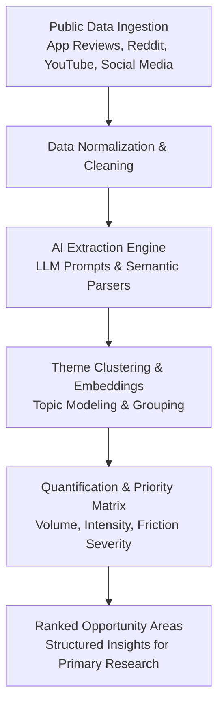

# Problem Statement: AI-Powered Discovery Engine for Myntra Wishlist Conversion

---

## 1. Executive Summary & Context

**Myntra's Wishlist** feature represents one of the strongest indicators of high purchase intent across the platform. Users have actively engaged with the catalog, browsed various options, evaluated products, and made the conscious decision to save specific items for future purchase. In essence, these users have already cleared the hardest and most expensive stage of the e-commerce funnel: **product discovery**.

Despite this explicit high-intent signal, **only a small fraction of wishlisted fashion items convert into actual purchases within a 30-day window**.

---

## 2. Core Problem Definition

```
┌────────────────────────────────────────────────────────────────────────┐
│                        THE WISHLIST FUNNEL DILEMMA                     │
│                                                                        │
│   [ High Purchase Intent ] ──► [ Wishlist Addition ] ──► [ DROP-OFF ]  │
│        (Product Discovered)       (Saved for Later)       (Stalled)    │
│                                                                │       │
│                                                Why does conversion     │
│                                                break down here?        │
└────────────────────────────────────────────────────────────────────────┘
```

The underlying drivers and root causes of this conversion breakdown are currently undocumented and speculative. Potential friction points include:

1. **Unresolved Product Uncertainty:** Lingering doubts around sizing, fit accuracy, material/fabric quality, real-world color fidelity, or styling versatility.
2. **External / Off-Platform Decision Making:** Out-of-app price comparison, awaiting festival/payday discounts, seeking validation/opinions from friends and family, or waiting for specific life events/occasions.
3. **Behavioral Misalignment (Wishlist as Passive Bookmark):** Users utilizing the wishlist as an aesthetic moodboard or aspirational collection rather than an active pre-purchase queue.
4. **Checkout & Logistical Friction:** Delivery timelines, return policy ambiguity, or unexpected shipping/convenience fees.

> **The Risk:** Without empirically discovering which friction points dominate—and across which specific customer/product segments—any proposed product or feature intervention risks solving the wrong problem.

---

## 3. The Objective: AI-Powered Discovery Engine

Before architecting or prescribing user-facing solutions, we must build an **AI-powered intelligence pipeline** that analyzes public, at-scale user feedback and unstructured discussions across the web to surface empirical reasons why wishlisted fashion items stall before checkout.

### Key Capabilities Required:
- **Beyond Basic Sentiment Tagging:** Must move beyond generic positive/negative sentiment to extract semantic root causes, behavioral signals, and contextual friction points.
- **Clustering & Categorization:** Automatically group unstructured user voice data into discrete, well-defined opportunity themes (e.g., *Size & Fit Anxiety*, *Price-Drop Speculation*, *Social Validation Deficit*, *Catalog Bookmarking*).
- **Quantification & Priority Scoring:** Measure frequency, emotional intensity, and co-occurrence across themes to produce a ranked, evidence-backed hierarchy of opportunity areas.

---

## 4. Ingestion Sources (Unstructured Public Data)

The pipeline ingests real, multi-channel customer conversations and feedback:

| Source Type | Specific Channels | Insights Gathered |
| :--- | :--- | :--- |
| **App Marketplaces** | Apple App Store & Google Play Store Reviews | Direct app usability, wishlist complaints, pricing, expectations |
| **Community Forums** | Reddit (e.g., `r/IndianFashionAddicts`, `r/TwoXIndia`, `r/dealsforindia`) | Candid discussions on sizing, fabric authenticity, buying habits |
| **Social & Video Media** | YouTube comments (haul reviews, try-on videos), Instagram & X (Twitter) | Visual expectations vs. reality, price comparison, fit discussions |
| **E-Commerce Threads** | Fashion discussion boards & shopping forums | Deals, discount wait behavior, peer recommendations |

---

## 5. Discovery Engine Architecture & Workflow



1. **Ingestion & Normalization:** Ingest raw text reviews, comments, and forum threads; sanitize metadata and remove noise.
2. **AI Extraction & Reasoning (LLM / Agentic Workflow):** Leverage LLM capabilities (GPT, Claude, or Agentic workflows) to parse contextual reasons behind cart/wishlist abandonment.
3. **Clustering & Synthesis:** Cluster related friction points using semantic embeddings and topic modeling.
4. **Quantification & Ranking:** Rank opportunity areas based on frequency of occurrence, user emotional urgency, and potential business impact.

---

## 6. Expected Output & Deliverables

1. **Functional Discovery Pipeline:** An automated or scriptable workflow (using Claude/GPT APIs, n8n, Zapier, or a Python AI stack) capable of ingesting raw unstructured feedback and extracting structured opportunity categories.
2. **Structured Opportunity Matrix:** A comparative breakdown detailing:
   - **Identified Theme / Opportunity Area**
   - **Prevalence & Confidence Score**
   - **Sample User Quotes / Ground Truth Evidence**
   - **Associated User Persona / Segment**
3. **Strategic Recommendations:** Prioritized, ranked candidate problem areas ready for validation in deeper primary user research (Part 3).
